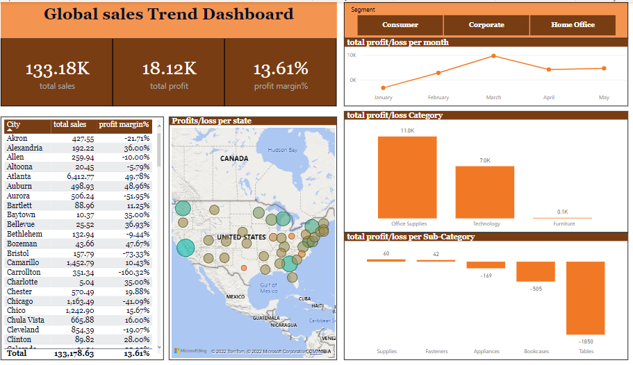

# Global Sales & Profit Performance Dashboard

A Power BI dashboard tracking total sales, profit, and margin performance across customer segments, geography, and product categories.

[View live Power BI dashboard](https://app.powerbi.com/view?r=eyJrIjoiODYwNzllZjgtMmY3MS00MDFkLTkzNjAtYzAyOGNhNjU1NGQ1IiwidCI6IjdiYWEzZDBkLTdmZjYtNDFkNS05NmQ3LTg0NzM3NzY0NjAyMSJ9) | [View portfolio](https://yusuf-data-analytics-portfolio.netlify.app/)

## Project overview

This dashboard analyzes sales and profitability across cities, product categories, and sub-categories over a multi-month reporting period. It is built to help a sales operations or finance stakeholder see not just how much revenue is coming in, but where that revenue is actually turning into profit and where it isn't.

This project is relevant to anyone evaluating whether I can move past top-line revenue reporting into margin analysis: separating segments that look strong on sales alone from segments that are quietly losing money.

## Business questions

- Which cities and product categories generate the most profit, not just the most sales?
- Which product sub-categories are actually losing money, and how large is that drag?
- How does profit performance trend month over month?

## Key KPIs

| KPI | What it measures | Why it matters |
|---|---|---|
| Total sales | Sum of all recorded sales in the reporting period | Baseline revenue figure |
| Total profit | Sum of profit across all transactions | Shows how much of that revenue converts to profit |
| Overall profit margin | Total profit ÷ total sales | Normalizes profitability regardless of scale |
| Sales & margin by city | Revenue and profit margin broken out geographically | Flags which locations are both high-revenue and high-margin |
| Profit by category / sub-category | Profit contribution at category and sub-category level | Identifies exactly where money is made or lost within the product mix |
| Monthly profit trend | Profit/loss tracked month over month | Shows whether performance is improving, flat, or declining over time |

## Key findings

- Total sales for the reporting period were **$133.18K**, generating **$18.12K** in profit, for an overall profit margin of **13.61%** — meaning the large majority of revenue is consumed by costs rather than converted to profit.
- Profit margin varies sharply by city even among top sales performers: Atlanta ($6,412.77 sales, 49.78% margin), Midland ($3,999.70, 48.70% margin), and Dover ($724.34, 46.88% margin) all convert roughly half of their sales into profit, well above the 13.61% company-wide average — suggesting these locations, or the mix of products they sell, are disproportionately profitable relative to their size. The city-level table also shows some deeply negative outliers, including Carrollton (-160.32% margin) and Bristol (-73.33% margin).
- Office Supplies is the strongest profit contributor ($11.0K), ahead of Technology ($7.0K), while Furniture contributes almost nothing ($0.1K) despite presumably carrying meaningful sales volume.
- Three sub-categories are actively unprofitable: Tables (-$1,850), Bookcases (-$505), and Appliances (-$169). Tables alone offset a meaningful share of the gains made elsewhere in the product mix.
- Monthly profit tracked from January through May, peaking in March before leveling off, with April profit recorded at $4,187.50 — indicating performance is not steadily climbing but fluctuating month to month.
- The dashboard also segments by customer type (Consumer, Corporate, Home Office) and plots profit/loss geographically by state, though specific figures for those views were not captured in this review.

## Business recommendations

These are reasonable actions the findings could support; they have not been implemented and no real-world business outcome is claimed:

- **Investigate the Tables and Bookcases sub-categories.** Since these are the two largest sources of negative profit, a next step would be to check whether the issue is pricing, discounting, shipping cost, or return rates before deciding whether to reprice, renegotiate, or discontinue them.
- **Study what Atlanta, Midland, and Dover are doing differently.** Their margins are roughly 3.5x the company average; understanding whether that's product mix, customer type, or local pricing could inform whether it's replicable elsewhere.
- **Review the deeply negative-margin cities (e.g. Carrollton, Bristol) individually.** Margins below -70% suggest either a data/allocation issue or a genuinely loss-making set of transactions worth investigating before drawing conclusions.
- **Protect and grow Office Supplies and Technology.** These two categories carry the profit story; the data suggests they warrant continued inventory and marketing priority ahead of Furniture.

## Dashboard preview



## Dashboard structure

Based on direct review, the report includes:

- **Overview page.** KPI cards for total sales, total profit, and profit margin; a segment filter (Consumer, Corporate, Home Office); a sortable city-level table of sales and margin; a geographic map of profit/loss by state; category and sub-category profit charts; and a monthly profit/loss trend line (January–May).

There may be additional pages/tabs beyond this one that have not been reviewed.

## Tools and technologies

- Power BI

Underlying Power Query and DAX logic could not be verified, since the published report does not expose the data model to a public viewer.

## Data preparation and methodology

See [`documentation/methodology.md`](documentation/methodology.md).

## Repository structure

```
/
├── README.md
├── screenshots/
│   └── README.md
└── documentation/
    └── methodology.md
```

## Business value

A sales operations manager or finance analyst could use this dashboard to decide where to focus margin-improvement work: which product lines to review for pricing or cost issues, and which regions' practices might be worth studying and replicating.

## Limitations

- **Data source and scale not independently verified.** The published Power BI report does not expose the underlying dataset, so the origin (real, public sample, or synthetic) of the sales records could not be confirmed.
- **Underlying data model not accessible.** DAX measures, relationships, and Power Query transformations behind the visuals cannot be reviewed from the public viewer link.
- **Reporting period is short.** The monthly trend covers January through May only, which limits how much can be concluded about longer-term seasonality.
- **Segment and state-level map figures not fully captured** in this review — only the overview page's headline numbers and city table were documented in detail.
